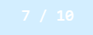
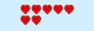

# phaser-health-meter

Phaser Health Meter is a Phaser plugin that lets you easily insert health meters for your sprites. Meters can be attached to any sprite and update dynamically based on the sprite's [health component](http://phaser.io/docs/2.4.4/Phaser.Component.Health.html).

## Getting started

### 1. Include healthMeter.js

Copy healthMeter.js into your project's plugin directory. Load the script after you load phaser.js.

### 2. Load & setup the plugin

In your state (or in your game if you aren't using states) have Phaser load the plugin. Then set up the plugin type you want to display along with setup parameters. More details on the available options are below. 

Don't forget to set your player's starting health and maxHealth.

```javascript
create: function() {
	...
	this.player.health = 50;
	this.player.maxHealth = 100;

	this.playerHealthMeter = this.game.add.plugin(Phaser.Plugin.HealthMeter);
	this.playerHealthMeter.bar(
		this.player,
		{x: 20, y: 100, width: 100, height: 20}
	);
}
```

### 3. Call the health meter's update method.

In your update loop, simply call update on the health meter.

```javascript
update: function() {
	...
	this.playerHealthMeter.update();
}
```

## Configuration options

There are currently three types of health meters: text, bar, and icon.

### Text health meter

The text health meter shows the player's health and max health in plain text.



Available options:

- x: set the left x coordinate of the health meter
- y: set the top y coordinate of the health meter

### Bar health meter

The bar health meter shows the player's health as a two layer bar, with the max health displayed behind the current health. Think Mortal Kombat.


Available options:

- x: set the left x coordinate of the health meter
- y: set the top y coordinate of the health meter
- width: the max width of the health meter (thus the width of the maxHealth meter)
- height: the height of the meter

### Icon health meter.

The icon health meter shows the player's health as a series of icons. Think Zelda hearts. You can set the icon and configure the number if rows used. This works especially well for simple RPG games where the max health stays relatively low. It does not currently support partial hearts.

When using this mode, your sprite's maxHealth should be set at the max it will ever be during this game or stage. If you change its maxHealth parameter mid-game you must reinitialize the health meter.



Available options:

- x: set the left x coordinate of the health meter
- y: set the top y coordinate of the health meter
- width: the width of a single icon
- height: the height of a single icon
- rows: the number of rows in which the icon will be displayed
- icon: the Phaser name of the image you want to use as your icon (this should be setup in your preloader)

Icons are displayed from the top left to the bottom right. They are removed from the bottom right to the top left. The max health should be divisible by the number of rows.